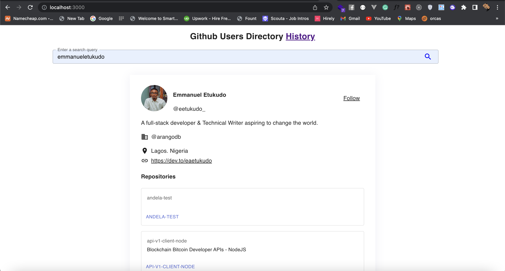

# RZLT App

The RZLT app is a GitHub search app based on the GitHub API written in `Typescript` and React, bootstrapped with [Create React App](https://github.com/facebook/create-react-app).

There are three major dependencies worthy of mention, [Material UI](https://mui.com/) for the UI components, [React Router Dom](https://v5.reactrouter.com/web/guides/quick-start) for routing and [Styled-components](https://styled-components.com/) for building the UI. This project leverages [Github API](https://api.github.com/)' API for featching and displaying data.

## Instalation/Setup
To setup, the application locally, follow the instructions below

## Instaling Dependences
In the project directory, you can run:
`npm install` to install all the required dependencies for the project.

### Starting the application
Run `npm start` to start the app in the development mode.\
Open [http://localhost:3000](http://localhost:3000) to view it in your browser.

The page will reload when you make changes.\
You may also see any lint errors in the console.

### Testing
Run the `npm test` to start the test runner in the interactive watch mode.\
See the section about [running tests](https://facebook.github.io/create-react-app/docs/running-tests) for more information.

Each of the files with their corresponding test cases is named with the `.test.js` extension and stored in the `__tests__`  folder except the mocked api `API` response that is under the `/api/__mock__` folder.

### Building the application

Run `npm run build` to build the app for production. The output of the build files will be under the `build` folder.\
It correctly bundles React in production mode and optimizes the build for the best performance.
The build is minified and the filenames include the hashes.\

Happy Hacking!
